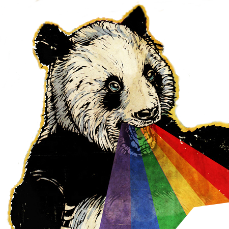

colorphobic
===========

Are you afraid of colored images?
Do you think the `rainbow color scale` should be banned?

Than colorphobic is for you!

## tl;dr

Reconstruct the data behind a color scale image from the corresponding values in a
colorbar.
Pure client-side javascript, no server will eat your data.

[Let me try it!](https://ax3l.github.io/colorphobic/)

## But why?

If you are a scientist, this tool is *not* for you.
Scientists *always* store and publish the scripts and the data that
produced "shiny image XY" published in year `y = $this - rand()`.

Therefore you will never come to the point were you are stopped trying
to reconstruct a lineout of a crumpy 100x123 pixel image with a obfuscating
rainbow color scale.

Of course, the only use of this tool is to reconstruct the data from
images similar to the previously mentioned scenario in case of a hard
drive crash (or a zombie outbreak) that destroyed all three offline copies.

P.S.: Please follow an [open access](https://en.wikipedia.org/wiki/Open_access)
      strategy.
      ... and publish the data behind your plots!
      [Think an other minute](http://www.sron.nl/~pault/#schemecomparison)
      about your color scales.

## License

This tool is open source, published under the AGPLv3+.
See [LICENSE](LICENSE).

## Kudos

This tool relies on open source software and open software standards, namely:

  - [jQuery: Base and ImgAreaSelect](https://plugins.jquery.com/imgareaselect/)
  - [jqPlot](http://www.jqplot.com)
  - [HTML5: Canvas](http://www.w3schools.com/tags/canvas_drawimage.asp)

Image Credit: Adapted version,
              (CC) BY-NC [The Searcher](https://secure.flickr.com/photos/bar-art/),
                         [*Of Pandas and Rainbows*](https://flic.kr/p/5e8WXU)
